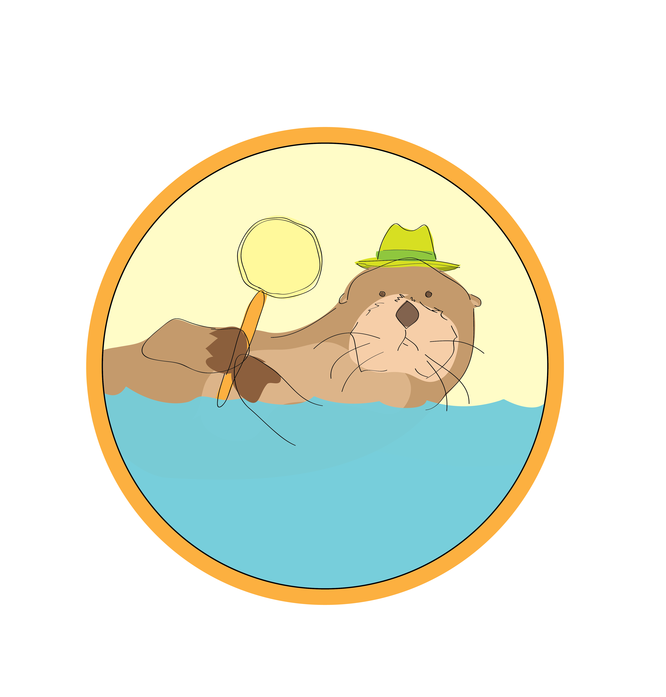
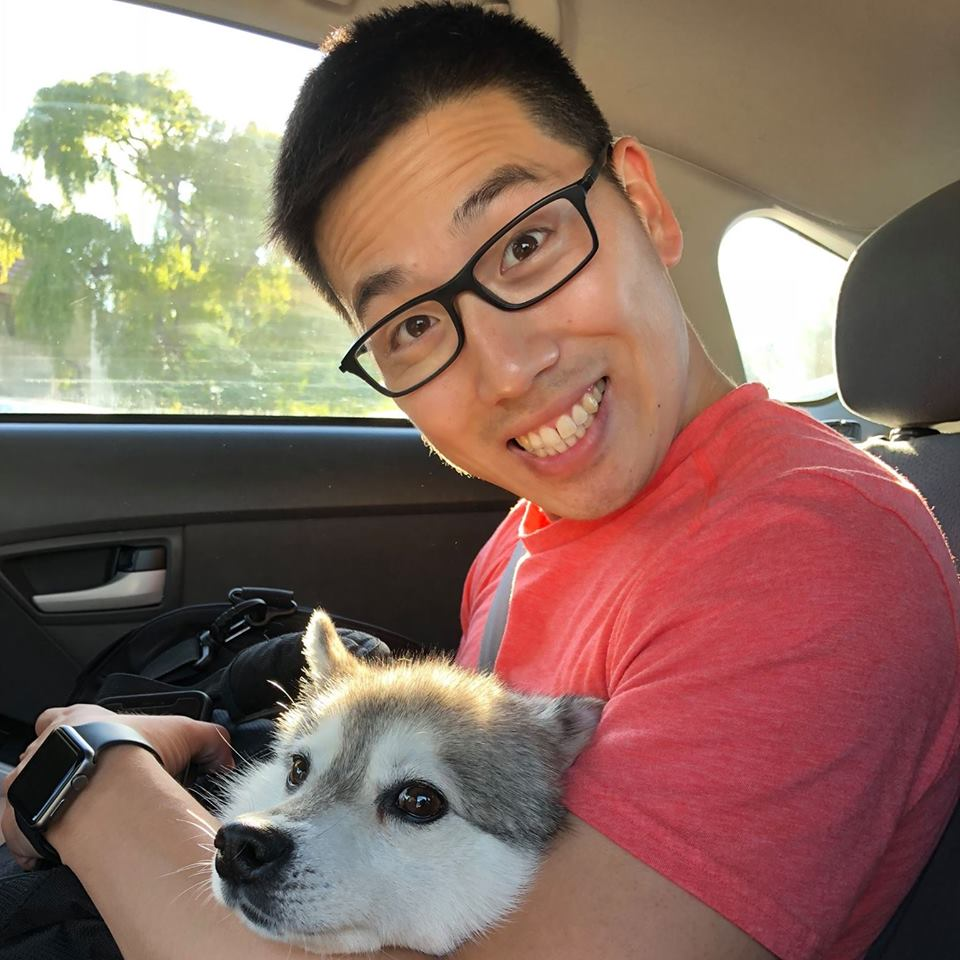

## Welcome to Inspector Otter's Word Search Engine:exclamation: :tophat: :eyeglasses: :mag_right:

# <a name="introduction"> Introduction </a>
Inspector Otter's Word Search Engine is a professional, reliable, efficient word definer and translator. 
* Are you new to an area and find yourself constantly confused by the lingo that locals use?
* Are you tired of feeling left out when hearing your friends speak in slang terms you don't understand? 
* Are you a parent trying to wrap your head around the nonsensical jargon your teenager says to you and/or their peers? 

If you answered YES to any of the questions above, HAVE NO FEAR! Inspector Otter's Word Search is here to help YOU! 

---

# Table of Contents

- [Introduction](#introduction) 
- [Technologies Used](#technology) 
    * [HTML](#style) 
    * [CSS](#style) 
    * [BootStrap](#bootstrap) 
    * [GoogleFonts](#google) 
    * [Jumble](#jumble) 
    * [Bideo.js](#bideo)
    * [JavaScript](#java)
    * [JQuery](#java)
    * [AJAX](#ajax)
    * [Firebase](#firebase)
- [Deployed Site](#deployed)
- [Meet the Authors](#authors)
- [About Inspector Otter](#otter)

---

# <a name="technology"> Technologies Used </a>

#### <a name="style"> HTML CSS BootStrap</a>

Upon loading our site, the user will see several items displayed on the screen. 
1) A background video of waves coming ashore.
2) A grey navigation bar at the top of the webpage displaying Inspector Otter's Logo to the left and a word search bar to the right with a yellow submit button. 
3) A search area to the left where the user may put in their location and find cafes near them (as people who search word definitions may be new to the area). 
4) An area where previously search words are displayed for the user to see. 
5) A dark blue colored footer with an About button. 

Upon clicking the **submit** button for a search word within the navigation bar, the user will be shown the **Merriam-Webster** definition of the word, along with several **new** buttons. The four new buttons that appear when a user searches a word are **Spanish**, **Chinese**, **Russian** and **Unofficial Definition**. 

When clicked, the Spanish Chinese and Russian buttons, display the searched word's **translation**. When the unofficial definition button is clicked, the **Urban Dictionary** definition of the word searched is displayed. 

When a user searches a location within the cafe search, images and information regarding local cafes are displayed so the user may get acquainted with the area as they may be new to the city or traveling from far away.

In terms of styling the webpage, we used <a name="bootstrap">BootStrap</a> display the Navigation Bar, the Footer, Buttons, About page popup and to make our website responsive. We also used our own CSS style sheet to change some colors, fonts, positioning. Additionally we used <a name="google"> GoogleFonts</a> to display our text using Inconsolata font.

#### <a name="jumble">Jumble</a>

Jumble is a jQuery plugin that jumbles up the colors of your text headers, and can also animate them. We used this plugin to bring more color to our webpage. You can see the Jumble effect being used on the Names of the Authors on the About section of the website.

More information regarding Jumble can be found at: https://github.com/vonKristoff/jumble

#### <a name="bideo">Bideo.js</a>

Bideo.js is a JavaScript plugin which is a tool used to play a video in the background of a container/body. For our webpage we decided to feature a video of a string of waves crashing onto the beach for aesthetic reasons.

More information regarding Bideo.js can be found at: https://github.com/rishabhp/bideo.js 

#### <a name="java">JavaScript & Jquery</a>
The majority of our html webpage is being append through our JavaScript file using the Jquery library. Our JavaScript is organized ........

#### <a name="firebase">Firebase</a>
We are storing the user-inputted word into Firebase and calling back to Firebase to display the word on the page 

#### <a name="ajax">AJAX</a>
Our team uses several APIs for our Inspector Otter Webpage. 
1) We are using Webster Dictionary API to retrieve the formal definitions of the word the user searches. https://www.merriam-webster.com/ 
2) We use Urban Dictionary API to retrieve the informal/slang word definitions the user can view upon clicking on the unofficial definition button. https://www.urbandictionary.com/
3) We incorporate google translate into our website through the Spanish, Chinese and Russian buttons. When a user clicks on these buttons, the translated word appears in the selected foreign language. https://cloud.google.com/translate/
4) In addition we are using Zomato api which allows us to pull information related to restaurants near a location the user inputs. The idea is to recommend cafes for the user to check out since our target group are new people to the area. https://www.zomato.com/

---

# <a name="deployed"> Deployed Site </a>
Use the link to see the deployed site: https://kchoi123.github.io/GroupProject1/

---

# <a name="authors">Meet the Authors!</a>

|     Author           |  Summary|    Fun Fact         | Hobbies    |
|----------------------|---------|---------------------|------------|
|<b>Andrew Xie :panda_face:   https://github.com/Xieandrew2235           |Andrew is a recent college graduate with a degree in International Politics. He hopes that this bootcamp will be the first step towards a career in web development. |Andrew graduated from college in China. | Watching sports games :baseball:  |
|<b>Cyrus Ghadiri :hatching_chick:  https://github.com/ctghadiri       |UC Berkeley full-stack student with interests in moving into back-end web development. |Travels to a new country every year. | Traveling :airplane:, Next stop Japan :jp:  |
|<b>Jennifer Powell :koala:   https://github.com/jerpowel321     |Born and raised in the bay area, Jennifer has spent the last several years working in public accounting. She currently attends UC Berkley extension Coding Bootcamp with the hopes of switching careers into web and software development.| Jennifer has been skydiving!| Card Games, :spades: :hearts: :clubs: :diamonds: Bowling, :bowling: Swimming :swimmer: |
|<b>Kevin Choi :rice_ball:   https://github.com/kchoi123         |Kevin Choi comes from a background in IT Infrastructure specializing in hybrid system deployment using co-locations, AWS, Azure, Rackspace, and SoftLayer. His goal is to develop tools that will help collaborate hardware and software incompatibilities, both technologically and departmentally.| Kevin has played on the US Junior National Badminton Team   | Netflix and sitting on the couch with his dog Polo :dog:|
|<b>Shayan Anoushiravani :cat:  https://github.com/shayansea  |Shayan is a Bay Area native and UC Davis graduate in Design, who enjoys the outdoors and art. He is currently on the path to becoming a combo of UX designer, graphic designer, and software developer. | Shayan has an amazing cat named Phineas. :cat: | Drawing, Cooking, Gardening :herb: |

# <a name="otter">About Inspector Otter</a>

Inspector Otter has made it his **life mission** to help **EVERYONE** understand what in the world people around you are saying. In addition to chirping, purring, squealing, and gurgling, Mr. Otter is an avid English speaker with over 10+ years of experience studying and sharing word definitions, and translations with those who seek his knowledge. 

In this day and age of advanced technology and ever-changing trends, if you find yourself struggling to understand a word you hear, why torture yourself and put yourself through the agonizing pain and struggle of researching that word, only to discover upon completion that the word has already become obsolete. Inspector Otter can complete research for you with a fraction of the time and effort! Best of all, he will do it for **FREE**! You might be asking yourself, "Free!? What's the catch?". Well today's your lucky day as there is no catch. Inspector Otter prides himself on doing all the heavy lifting for *YOU* so you can get back to **your life**! Why is Inspector Otter so generous and why does he do it for free you ask? Well, his philanthropic ways stems from an incident which occurred many moons ago.

Previously a Pop Mogul, Inspector Otter left his lavish lifestyle behind him shortly after witnessing an argument between two of his neighbors, Mr. Badger and Ms. Wolverine. One day, Inspector Otter decided to head out to his backyard and enjoy a couple of margaritas on his back porch. Upon entering his backyard, Inspector Otter notices Ms. Wolverine giving Mr. Badger a hand with some basic yard work. Upon completing various tasks such as picking apples, raking leaves, and mowing the lawn, Ms. Wolverine proceeds to exclaim "That was a piece of cake!". Unbeknownst to Mr. Badger, he thought Ms. Wolverine said something along the lines of **_you're_ a piece of cake**.

As Mr. Badger had been making extra effort to lose the extra 15 pounds he gained last winter, he took offense to her comments and scurried away into his burrow. 
Inspector Otter was casually eavesdropping on his neighbors' conversation and quickly recognized that the miscommunication was due to Ms. Wolverine's strong accent, which made it hard for Mr. Badger to understand. As Inspector Otter was comforting Mr. Badger from the stressful ordeal, he explained that the phrase "*piece of cake*", when Ms. Wolverine used it, meant that the yard work was simple to accomplish. Upon hearing Otter's explanation, Mr. Badger was red, filled with embarrassment and hurried over to Ms. Wolverine to apologize for his abrupt exit and for the misunderstanding. 

Inspector Otter recognizes that miscommunications happen everyday and hopes that he, through his hard work, can change lives for the better and ensure that people like you and I will never have to struggle to understand words that are being used, and to never find themselves in an embarrassing situation similar to that of Mr. Badger. 

